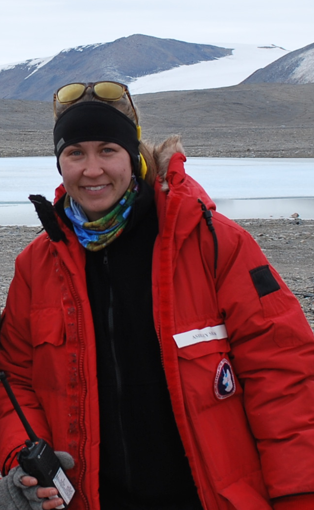

---
---

<link rel="stylesheet" href="styles.css" type="text/css">

I like to analyze data to answer research questions and test hypotheses. Currently I investigate questions community ecology at the [Institute for Ecology and Evolution](https://ie2.uoregon.edu/) at the University of Oregon.

I graduated from the [Colorado State University](http://www.sph.umn.edu/academics/divisions/biostatistics/) with a PhD in ecology in 2018 and an MSc in ecology in 2013. 

I am an R enthusiast, including serving on the board and being an active member of [R Ladies Eugene](http://www.rladiesnyc.org/). 

My full CV is available [here](files/Zabor_CV_2017_Q4.pdf).